# PID Chamber Heater Controller

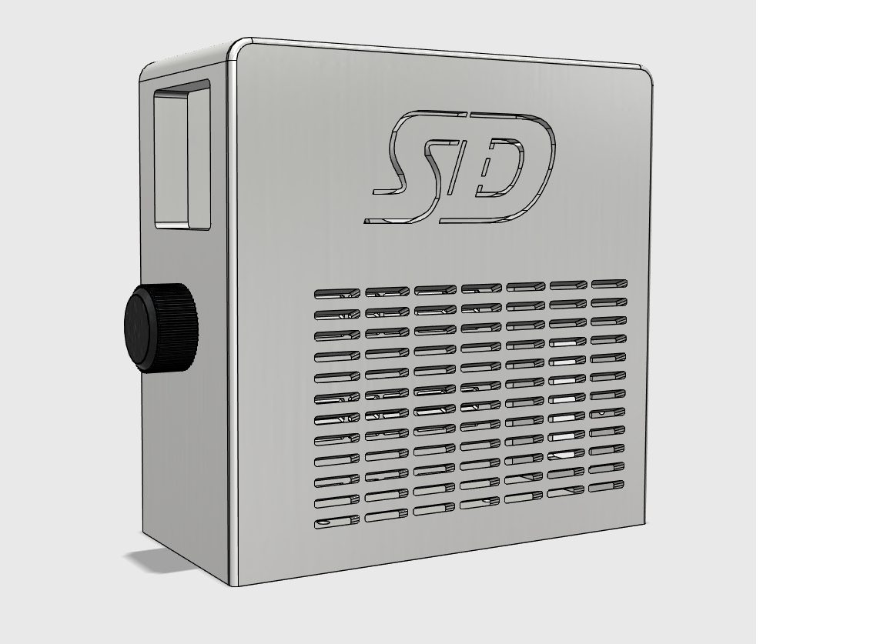

This project documents a standalone PID controller enclosure for a chamber heater setup. It is not tied to one specific printer.

## Current Status

This page covers the PID controller box and enclosure assembly. The PTC heater and fan assembly is still in progress and will be documented later.

## Safety Warning

This project uses mains AC power and a heater control circuit. Incorrect wiring can cause shock, fire, damaged equipment, or injury. Do not build or power this project unless you understand mains wiring and can verify every connection with the exact parts you are using.

Before powering the controller:

- Verify the input voltage used by your PID controller, fan power supply, heater, and power inlet.
- Verify the fuse rating matches the load and wire size.
- Verify the SSR rating is suitable for the heater load and is mounted to a heat sink correctly.
- Verify all ground connections are secure.
- Verify no exposed terminals can contact the printed enclosure or loose wiring.
- Verify the heater has proper airflow before it is allowed to run.
- Verify the temperature sensor is mounted where it can accurately measure chamber temperature.

## Electrical Rating Notes

The linked heater for this build is listed as `110V 500W`, which is about `4.55A`.

The PID kit includes an `SSR-40DA` style solid state relay, commonly marked as `40A`. Do not treat the SSR label as the safe rating for the full build. The real safe limit depends on the fuse, wire gauge, IEC inlet, SSR heat sinking, airflow, enclosure temperature, and build quality.

Treat this as a `500W heater build` unless you are qualified to re-rate the entire electrical system.

## PID-to-SSR Wiring Diagram

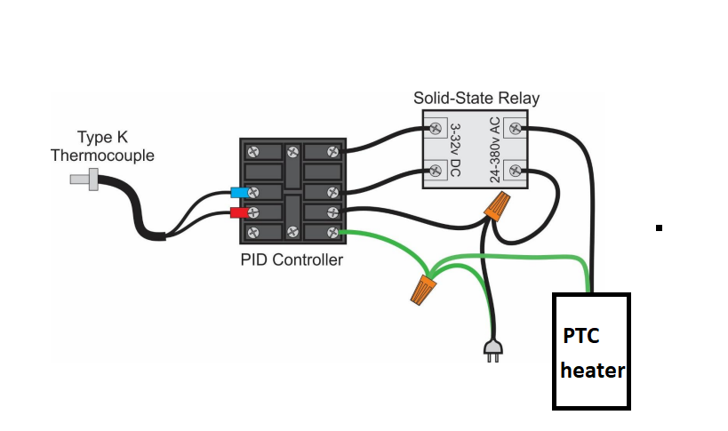

Use this as a simple visual guide for the PID controller, thermocouple, SSR, and PTC heater wiring path. Always compare the diagram to the labels printed on your exact PID controller and SSR before connecting power, because terminal layouts can vary between kits.

The PID controller uses the thermocouple to read temperature, then sends a low-voltage control signal to the SSR. The SSR switches mains AC power to the PTC heater.

Do not power the build until live, neutral, ground, SSR input, SSR output, and thermocouple polarity have all been checked.

## Build List

See the full [Materials List](./Materials-List.md).

Printable files:

- [`PID enclosure.stl`](./stl/PID%20enclosure.stl)
- [`PID door.stl`](./stl/PID%20door.stl)
- [`PID knob.stl`](./stl/PID%20knob.stl)

Source files are included in the [`source`](./source) folder.

## Assembly Instructions

### 1. Gather the parts

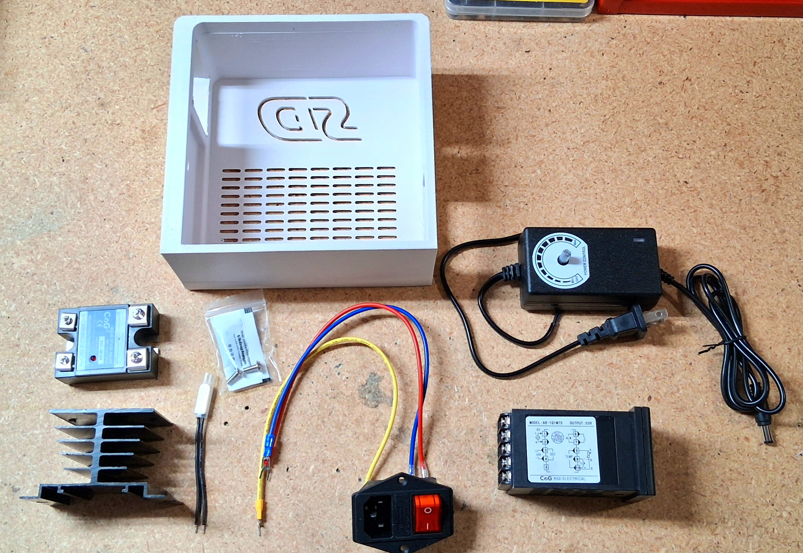

Lay out the printed enclosure, PID controller kit, SSR, heat sink, thermocouple, fused power inlet, fan controller, heater wiring, and hardware before assembly. Confirm that the printed enclosure openings match the parts before starting.

### 2. Install the rear M3 heat-set inserts

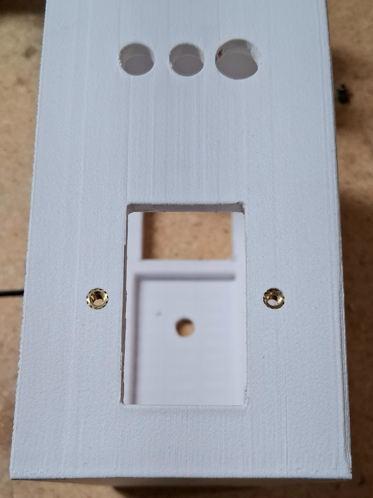

Install M3 heat-set inserts into the rear holes of the enclosure. Keep the inserts straight and flush so the rear hardware can fasten cleanly later.

### 3. Install the bottom M3 heat-set inserts

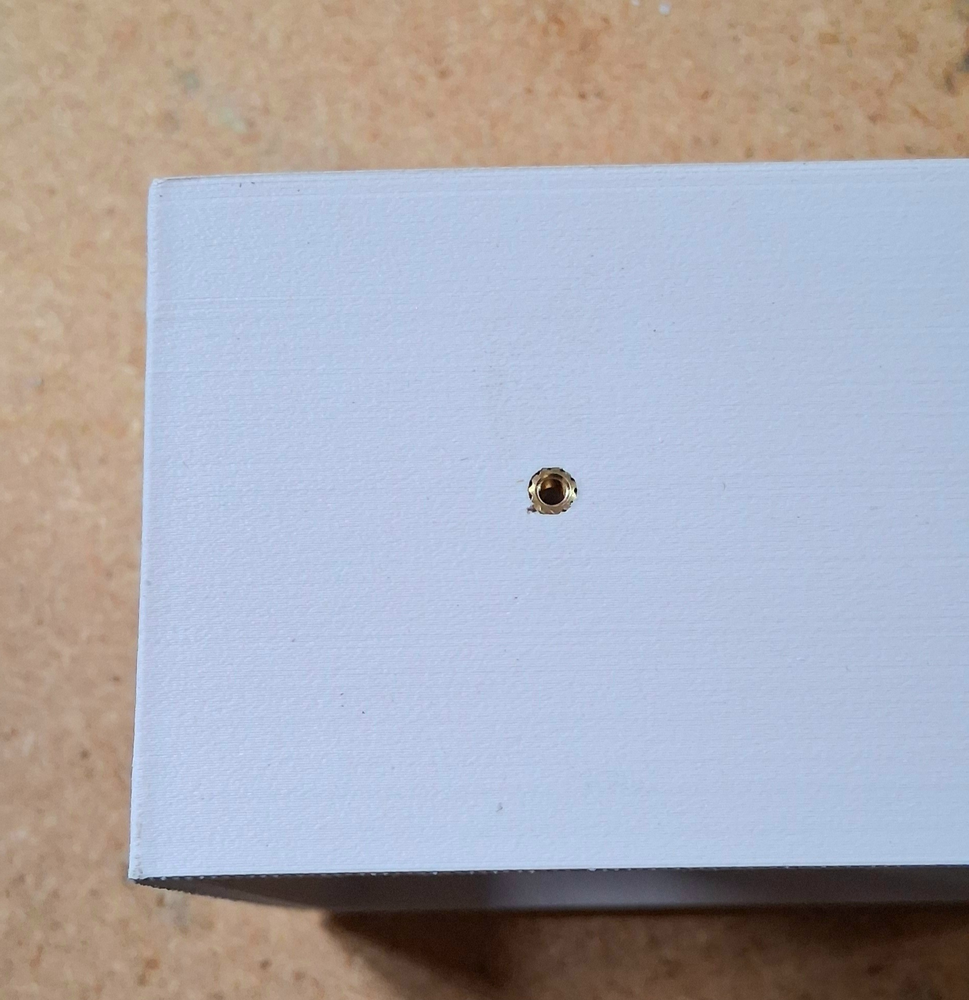

Install two additional M3 heat-set inserts in the bottom of the enclosure. These are used for fastening internal components and keeping the assembly secure.

### 4. Prepare the PID-to-SSR control wire

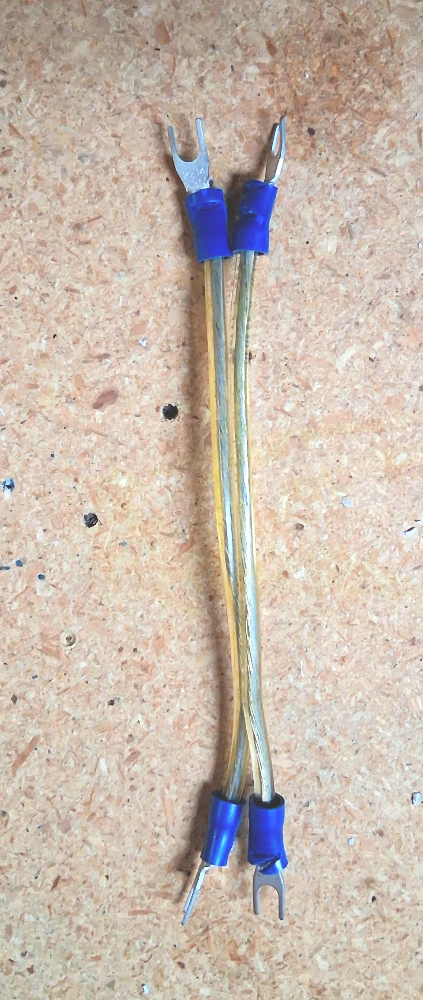

Prepare a short PID-to-SSR control wire, approximately `100 mm / 4 in` long. This wire connects the PID controller output to the SSR input. Use terminals that match the PID and SSR screw terminals, and leave enough length for service without creating extra loose wire inside the enclosure.

### 5. Prepare the fan controller

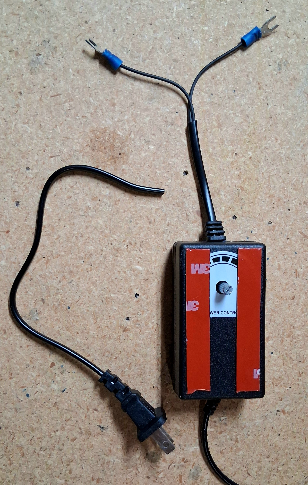

Prepare the fan controller by removing the knob and placing double-sided tape to the front of the controller as shown.

### 6. Route the fan controller plug

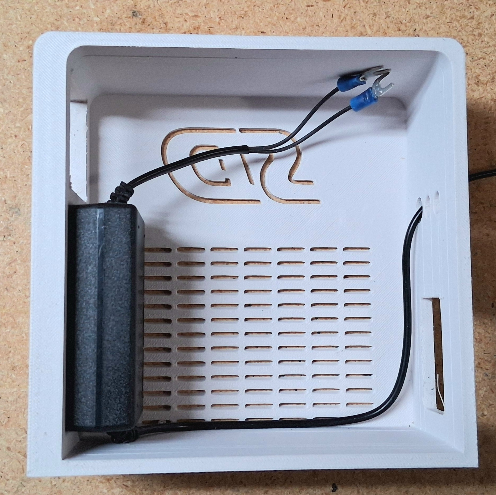

Pass the fan controller plug through the largest of the three rear holes. Attach the controller as shown and make sure the cable is not pinched or stretched.

### 7. Install the power inlet, sensor, heater wiring, and power supply wiring

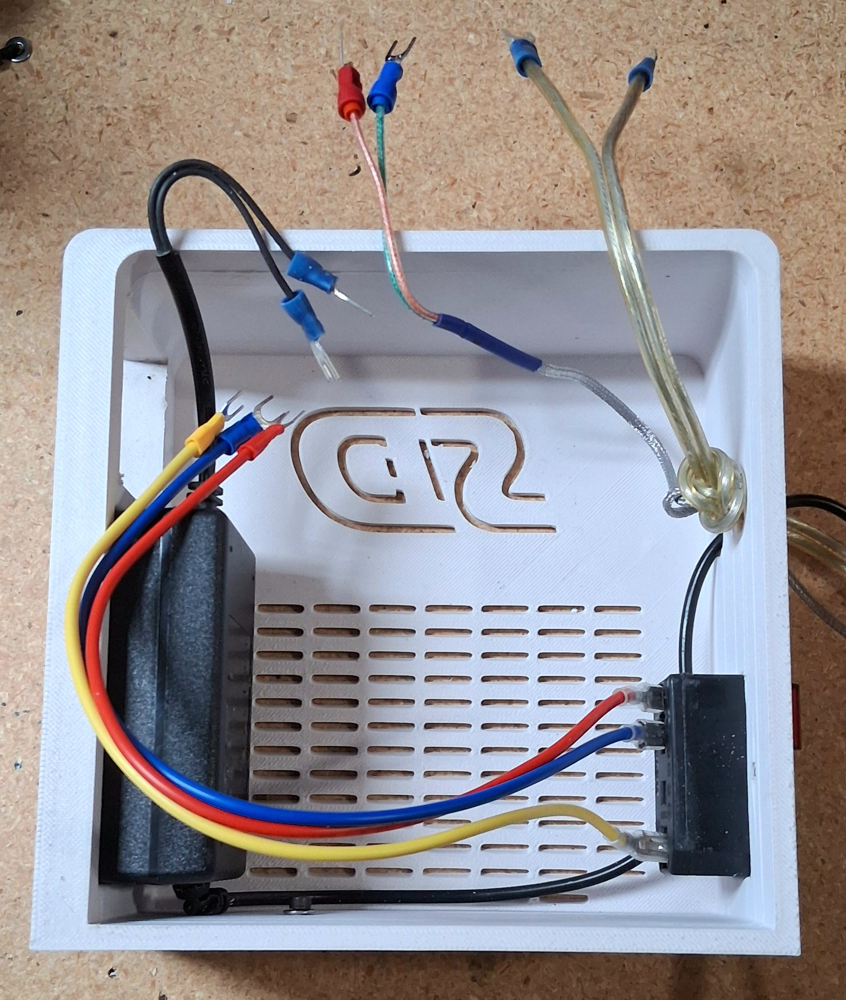

Install the fused power inlet in the rear opening. Route the temperature sensor and heater wiring through the rear holes. Attach the power supply or power inlet assembly with M3 screws as shown in the build photos.

Before continuing, verify the power inlet orientation and confirm which terminal is live, neutral, and ground. Do not rely on wire color alone.

### 8. Position the wires for the PID unit

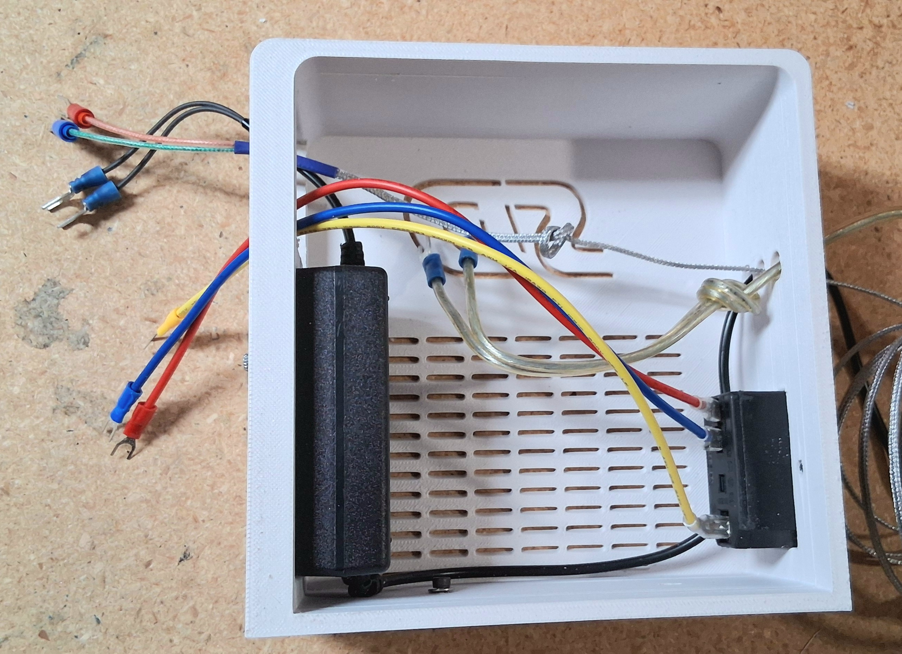

Position the wires so the PID controller can slide into place without crushing or sharply bending the connectors. Tie a knot in the appropriate wire as strain relief to help prevent the wire from pulling through the enclosure.

### 9. Install the PID-to-SSR wire on the PID unit

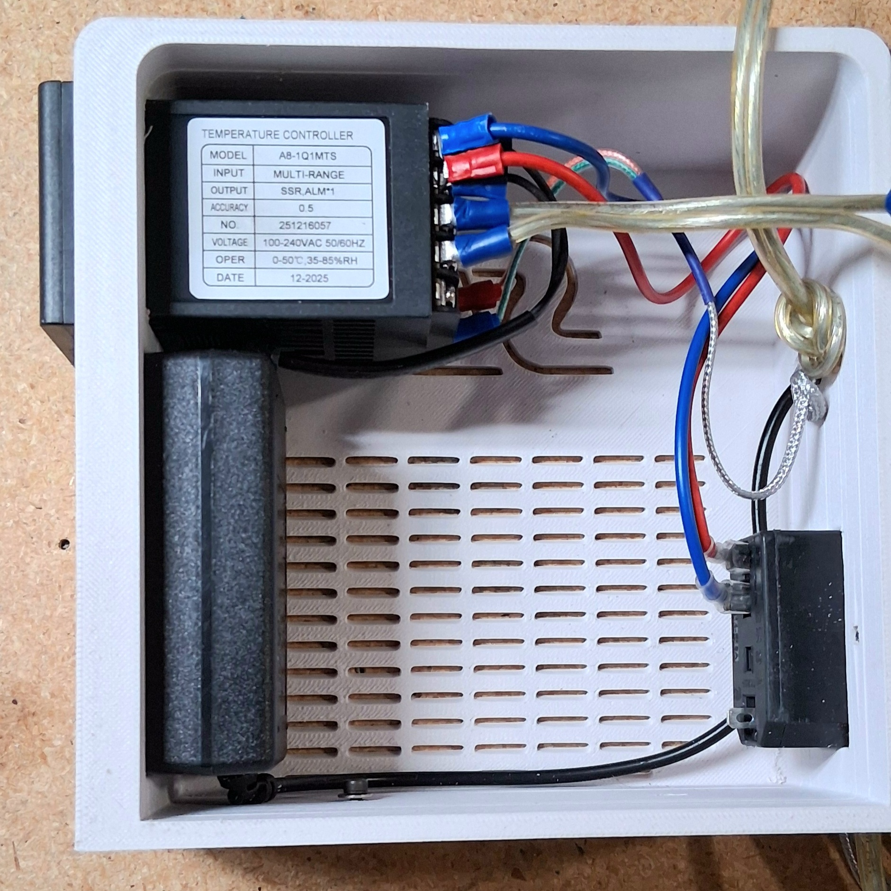

Install the `100 mm / 4 in` PID-to-SSR wire prepared earlier onto the PID controller. Bend electrical connectors only as needed for clearance when installing the PID unit into the printed enclosure.

Do not over-bend terminals or leave them close enough to short against another terminal.

### 10. Prepare the SSR and heat sink interface

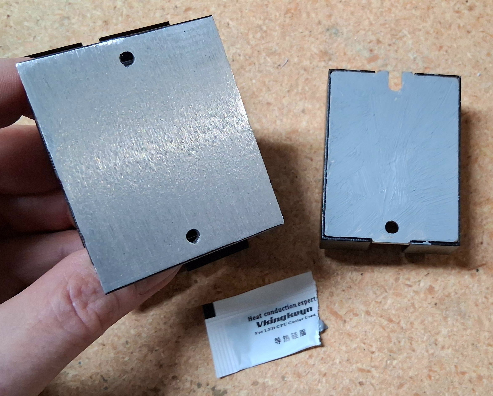

Prepare the SSR and heat sink mounting surface. If the mating surface is coated, rough, or uneven, sand the mounting surface back to bare metal where needed for better thermal contact. Apply thermal paste or the selected thermal interface material between the SSR and heat sink.

Do not sand electrical terminals, labels, or insulated wiring. Clean off dust before assembly.

### 11. Install and wire the SSR

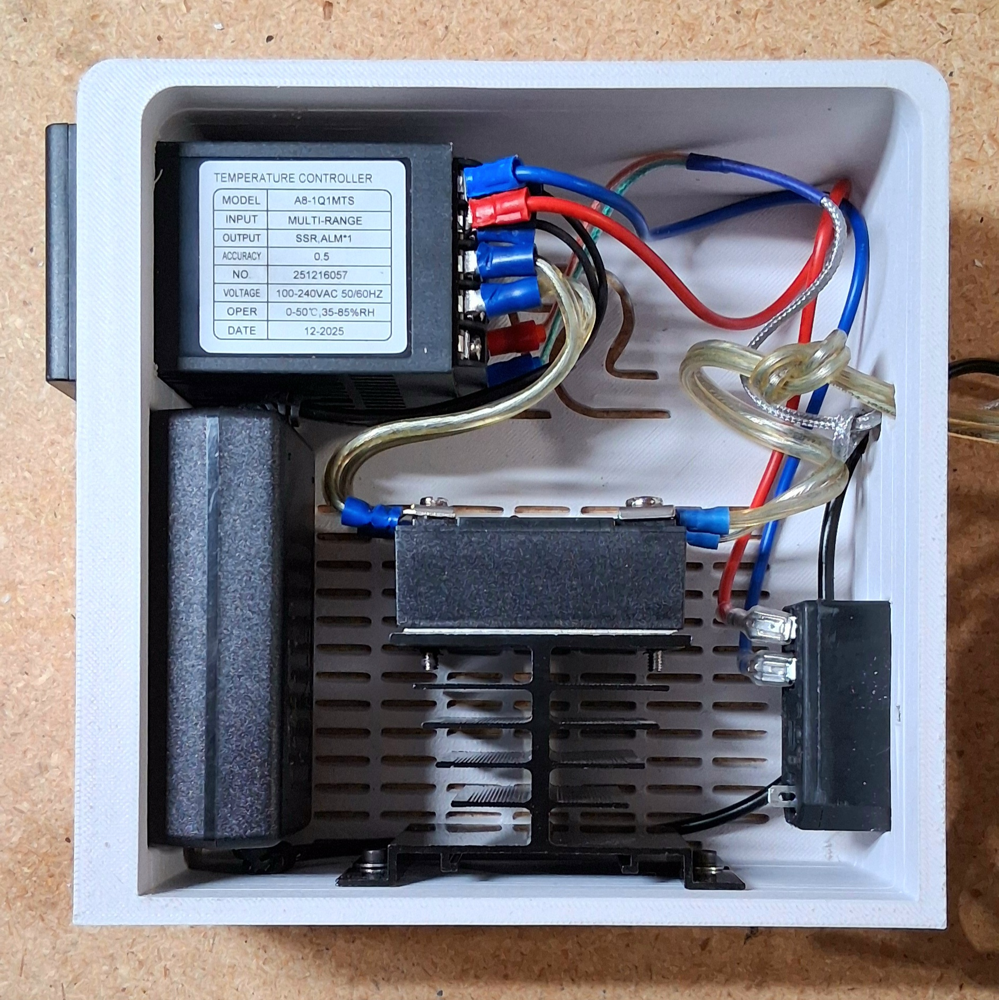

Install an M3 screw with washer in the forward lower hole, then attach the wiring to the SSR. Install the SSR onto the heat sink. Attach the ground wire from the power inlet to the rear heat sink screw.

Before closing the enclosure, tug-check the crimped terminals, verify the SSR input and output sides are wired correctly, and confirm the ground connection is secure.

## Pre-Power Checklist

- Confirm the fuse value is correct for the heater load.
- Confirm the SSR is mounted to the heat sink with thermal paste or a verified thermal pad.
- Confirm the ground wire is attached to the heat sink screw.
- Confirm all mains wiring is secured and insulated.
- Confirm the PID controller input voltage matches the power source.
- Confirm the thermocouple is connected to the correct PID terminals.
- Confirm the fan controller and fan run before enabling the heater.
- Confirm the PTC heater has forced airflow.

## Basic PID Controller Setup and Use

These are plain-English starter notes for someone who has never used a PID temperature controller before. Button names and menus can vary by controller, so compare this with the manual for the exact PID unit you install.

### What the controller is doing

The controller reads the temperature probe, compares it to the temperature you set, and turns the heater on and off through the SSR.

Most controllers show two numbers:

- The current temperature is what the probe is reading now.
- The set temperature is the temperature you want it to hold.

When the output light is on, the controller is asking the heater to heat. When the output light is off, the controller is not asking for heat.

### First safe power-up

- Start with a low temperature target for testing.
- Keep the fan running any time the heater is allowed to turn on.
- Stay with the controller during the first test.
- Be ready to switch power off if the heater does not behave as expected.
- Watch the actual temperature and make sure it rises slowly and responds normally.

### Set the temperature

- Press `SET` once.
- Use the arrow buttons to change the target temperature.
- If your controller has a shift button, use it to move between digits.
- Press `SET` again to save the number.

For first testing, use a low target temperature. Do not jump straight to the final chamber temperature until you know the wiring, fan, heater, and temperature probe are working correctly.

### Teach the controller how the heater behaves

Many PID controllers have an auto-tune feature. Auto-tune means the controller learns how fast your heater warms up and cools down, then saves better settings for holding temperature.

Use auto-tune only after the heater, fan, and temperature probe are mounted in their real working positions.

- Set a safe test temperature.
- Start auto-tune using the button sequence for your controller.
- Stay with the controller while it runs.
- Expect the heater to turn on and off during the test.
- Do not change the temperature setting while auto-tune is running.
- When auto-tune finishes, the controller should go back to normal temperature control.

If the temperature climbs too high, the fan stops, or anything smells hot, shut it off and fix the problem before trying again.

### Normal use

- Turn the controller on.
- Turn the fan on and confirm airflow.
- Set the chamber temperature you want.
- Watch the controller during warm-up.
- After it reaches the target temperature, make sure it can hold steady before walking away.

### Shutdown

- Turn the heater control off or lower the set temperature below the current chamber temperature.
- Let the fan keep running long enough to cool the heater.
- Turn off main power after the heater area is no longer hot.

## Coming Soon

- PTC heater assembly
- Fan mounting and airflow path
- Final chamber heater testing notes
